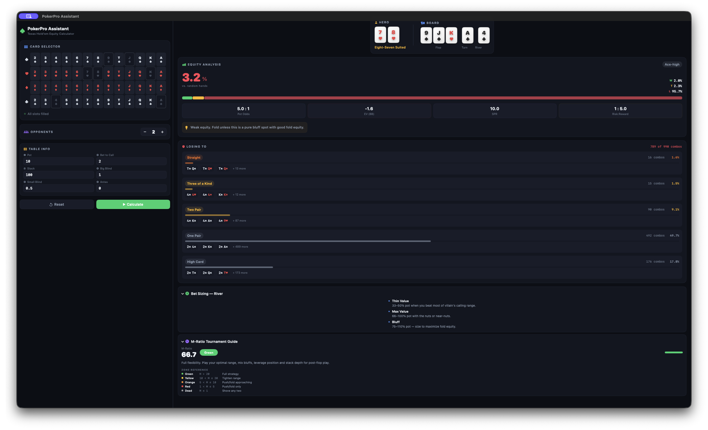

# PokerPro Assistant — Texas Hold'em Equity Calculator

A native macOS poker equity calculator built with SwiftUI. Enter your hole cards and board, and get real-time Monte Carlo equity simulation, pot-odds analysis, hand-range loss breakdown, and GTO-informed bet-sizing guidance — all in a clean dark interface.

---

## Features

- **Real-time Monte Carlo equity** — 10,000 simulation runs streamed in 1,000-iteration chunks so results update live as they compute
- **Losing hand breakdown** — enumerates every possible villain holding from the remaining deck and groups losing combos by hand category (straight, flush, full house, etc.) with percentage bars and example hole cards
- **Board wetness warning** — detects connected, flush-heavy boards where random-hand equity overstates real villain-range equity, and flags it inline
- **Pot odds & EV** — calculates pot odds percentage, expected value in chips and big blinds, stack-to-pot ratio, and risk:reward
- **M-ratio zone** — Green / Yellow / Orange / Red / Dead stack-depth zones with actionable push-fold guidance
- **Bet sizing guide** — street-aware sizing recommendations (preflop, flop, turn, river) keyed to hand strength tier
- **Multi-opponent support** — 1–8 opponents; equity recalculates instantly on change
- **Full 52-card grid** — tap to select/deselect; duplicate prevention, slot auto-advance

---

## Screenshots



*78s on a 9♠JK♥A♦4♠ river. 3.2% equity vs. random hands — losing hand panel shows straight (16 combos), three-of-a-kind (16), two pair (98), one pair (492), and high card (176) breakdowns with example holdings.*

---

## Requirements

- macOS 14 Sonoma or later
- Xcode 15 or later

---

## Installation

```bash
git clone https://github.com/Loffee5422/poker-equity-calculator.git
cd poker-equity-calculator
open poker.xcodeproj
```

Build and run with **⌘R** in Xcode. No dependencies, no package manager required.

---

## How It Works

### Equity (Monte Carlo)

Each simulation randomly deals cards from the remaining deck to fill the board and opponent hands, then evaluates all hands using a pure-Swift 5-to-7 card evaluator. Results stream back every 1,000 iterations using `AsyncStream`, keeping the UI responsive.

> **Note:** Equity is calculated against random two-card hands, not a modeled villain range. On wet boards (connected cards, flush draws), actual range equity is typically 5–15% lower than the figure shown. The board wetness warning surfaces this automatically.

### Losing Hand Enumeration

On any board with 3+ community cards, the engine enumerates all C(remaining, 2) villain combos (~990 on the flop, ~1,081 on the turn, ~1,176 on the river) and evaluates each against the hero's best 5-card hand. Results are grouped by `HandCategory`, sorted strongest-first, and displayed with combo counts and percentage of the remaining deck.

### Hand Evaluator

Pure Swift implementation. For 6- and 7-card inputs, all C(n,5) five-card subsets are evaluated and the best is returned. Five-card evaluation uses rank-count grouping + straight/flush detection — no lookup tables.

### Fast PRNG

Fisher-Yates shuffles inside Monte Carlo use a Xoroshiro128+ PRNG seeded from `UInt64.random`, avoiding the overhead of Swift's `SystemRandomNumberGenerator` in the inner loop.

---

## Architecture

```
poker/
├── PokerProAssistantApp.swift   Entry point
├── Models.swift                 Card, Rank, Suit, HandCategory, LosingHandGroup, PokerTheme
├── Engine.swift                 HandEvaluator, MonteCarloEngine, StrategyAdvisor
├── GameViewModel.swift          @MainActor ObservableObject — all state, calculateEquity(), computeLosingHands()
├── ContentView.swift            Root layout (left: card picker + controls, right: results)
├── CardGridView.swift           52-card selection grid
└── DashboardView.swift          EquityDashboardView, StrategyPanelView, LosingHandsView
```

---

## License

MIT — see [LICENSE](LICENSE).
